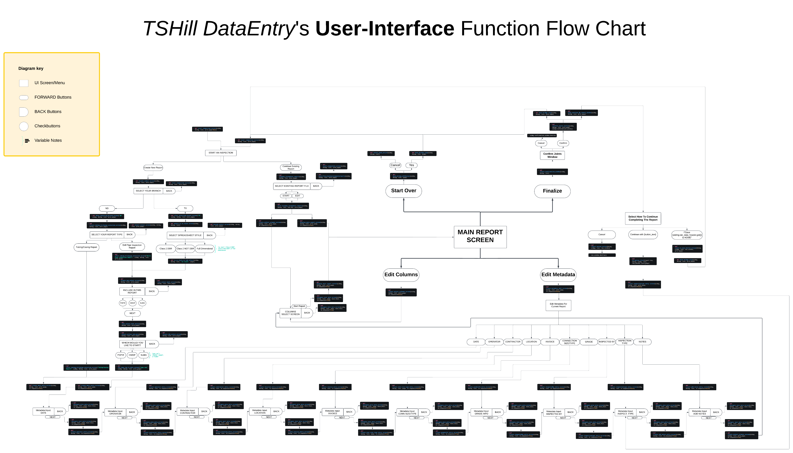

# TSHillData

TSHillData is a Python-based software solution designed to simplify and streamline the data entry process for Drill Pipe Inspection Reports. Developed to ensure compliance with the T.H. Hill DS-1 Volume 3: Drill Stem Inspection standards, TSHillData addresses inefficiencies in traditional report generation methods, eliminating transcription bottlenecks and reducing error rates.

This software was created independently as a solution to a critical problem observed in my role as a Front Desk Clerk for an oilfield services company. Initially hired for a basic administrative position requiring no formal education, I recognized inefficiencies that directly impacted the company's bottom line and taught myself Python programming to address them. Within a year, the immense value of my contributions led to a promotion to Efficiency Software Developer, a role where I now enjoy full autonomy to identify and implement innovative solutions that save the company time and money. TSHillData has since safeguarded millions of dollars annually by improving reporting accuracy and timeliness, securing customer trust, and optimizing operations.

While the initial version of TSHillData is fully functional and has proven its value in a production environment, this repository also serves as a showcase for my journey in refining and professionalizing the software. I am progressively refactoring the code to demonstrate best practices, improve maintainability, and optimize performance. This process highlights my ability to identify and resolve inefficiencies in code, much like the software itself resolves inefficiencies in recording drill pipe inspection report data.

---

## Table of Contents
- [Overview](#overview)
  - [Problem Statement](#problem-statement)
  - [Solution](#solution)
  - [Target Audience](#target-audience)
  - [Usage Context](#usage-context)
- [Key Features](#key-features)
- [File Types](#file-types)
- [System Requirements](#system-requirements)
- [Installation and Usage](#installation-and-usage)
  - [Installation](#installation)
  - [Usage](#usage)
- [Unique Aspects](#unique-aspects)
- [Planned Enhancements](#planned-enhancements)
- [Screenshots and Flowchart](#screenshots-and-flowchart)
- [License](#license)
- [Contact](#contact)

---

## Overview

### Problem Statement
Previously, Drill Pipe Inspection Reports were completed using time-consuming methods:
1. **Handwritten Reports**: Manually recorded data was transcribed into Excel, introducing errors and inefficiencies.
2. **Direct Excel Entry**: Required inspectors to input data directly into Excel, demanding redundancy and expertise in Excel.

### Solution
TSHillData combines simplicity with automation:
- **User-Friendly Interface**: Simplifies data entry, removing the need for Excel expertise.
- **Shorthand Inputs**: Reduces repetitive entries with keyword-based shorthand.
- **Data Safety**: Progressive saving prevents data loss.
- **Automated Output**: Exports directly to pre-configured Excel templates.

### Target Audience
Specifically designed for **Pathfinder Inspections**, TSHillData integrates into workflows to enhance service delivery for clients like **Marathon Oil** and **ConocoPhillips**.

### Usage Context
1. **On-Site Operations**: Installed on laptops in field conex boxes for inspector data entry.
2. **Off-Site Locations**: Installed on portable devices like GPD Micro PCs for remote operations.

---

## Key Features
- **Dynamic Data Entry**: Navigate rows using intuitive keyboard controls.
- **Configurable Columns**: Supports "BOX," "PIN," "TUBE," "SERIAL," and more.
- **Shorthand Keywords**: Efficient input for damage/repair info (e.g., `R 499400 DT MT 5 9/16`).
- **Error Reduction**: Automates shorthand translations to Excel.
- **Progressive Saving**: Saves data incrementally to JSON files.
- **Excel Integration**: Outputs to predefined Excel templates for review and delivery.

---

## File Types
- **JSON Files**: Stores data progressively for safety.
- **Excel Files**: Populated templates ensure consistent and compliant reports.

---

## System Requirements
- **Python Version**: 3.9.19
- **Required Libraries**:
  - `logging`, `sys`, `tkinter`, `tkcalendar`, `ttk`, `font`, `filedialog`, `messagebox`, `ttkthemes`
  - `json`, `threading`, `os`, `time`, `datetime`, `openpyxl`, `re`, `fpdf`

---

## Installation and Usage

### Installation
1. Install Python 3.9.19.
2. Install required libraries:
   pip install tkcalendar ttkthemes openpyxl fpdf
3. Run the TSHillData script to launch the application.

### Usage

#### Create a New Report:
1. Select the branch (ND or TX).
2. Choose a report type and configuration settings.
3. Enter report metadata.
4. Select column types and begin entering inspection data.

#### Continue an Existing Report:
1. Select a saved JSON file to resume data entry.
2. Export the finalized report to Excel for review and delivery.

## Unique Aspects
- **Industry-Specific Solution**: No direct competitors exist in the market for automating Drill Pipe Inspection Reports.
- **Customizable**: Easily adaptable to various Excel templates.
- **Cost Efficiency**: Saves millions annually by reducing time and error rates in report generation.

---

## Planned Enhancements
- **Refactored Code**: Improved readability and maintainability for long-term usability.
- **Optimized Functions**: Streamlined repetitive code for efficiency.
- **Professional Structure**: Transitioning to a more robust Python development framework.

---

## Screenshots and Flowchart

[Download the Flowchart PDF](assets/TSHillData_UserInterface_FlowChart.pdf)
Screenshots and video tutorials will be added to this repository soon.

---

## License
TSHillData is released under a **Non-Commercial License**. It is free for personal or educational purposes. **Commercial use requires prior authorization**.

---

## Contact
For inquiries or support, please contact **Chase Gartner** at [chasebgartner@gmail.com](mailto:chasebgartner@gmail.com).
